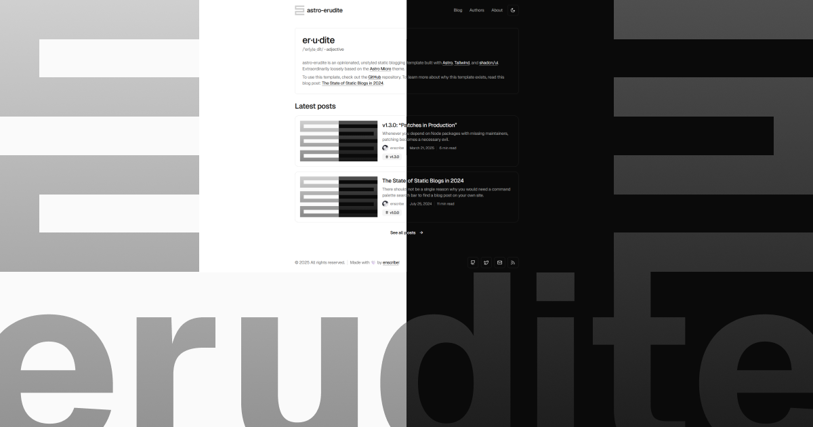
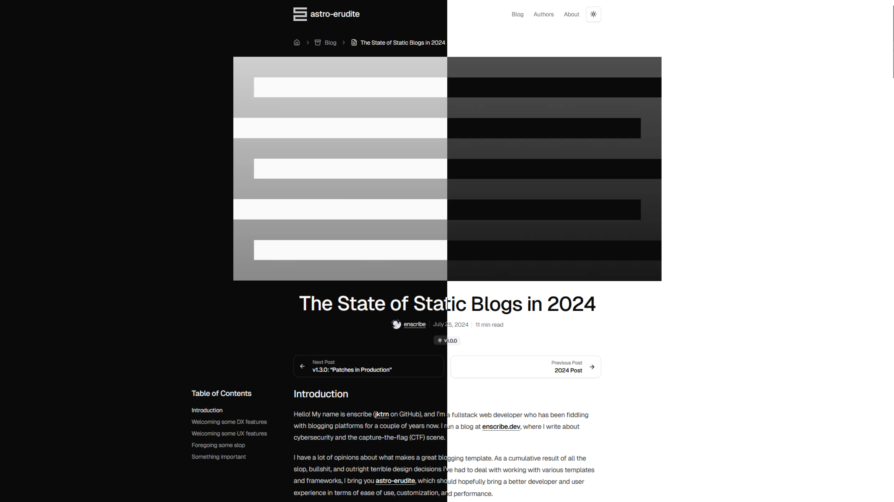
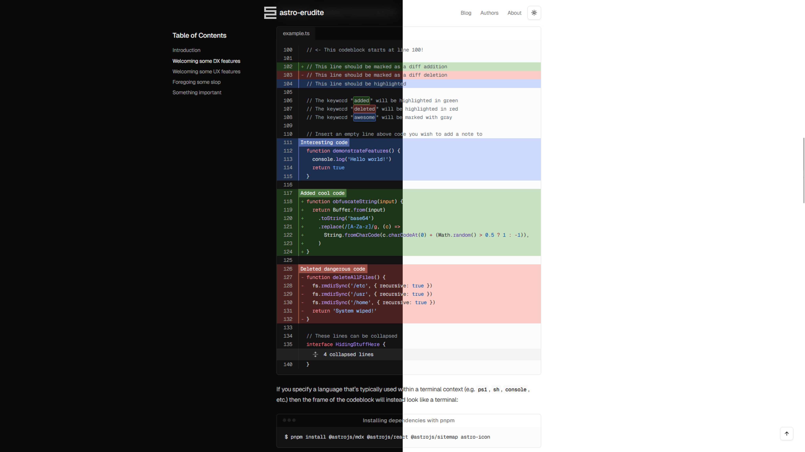
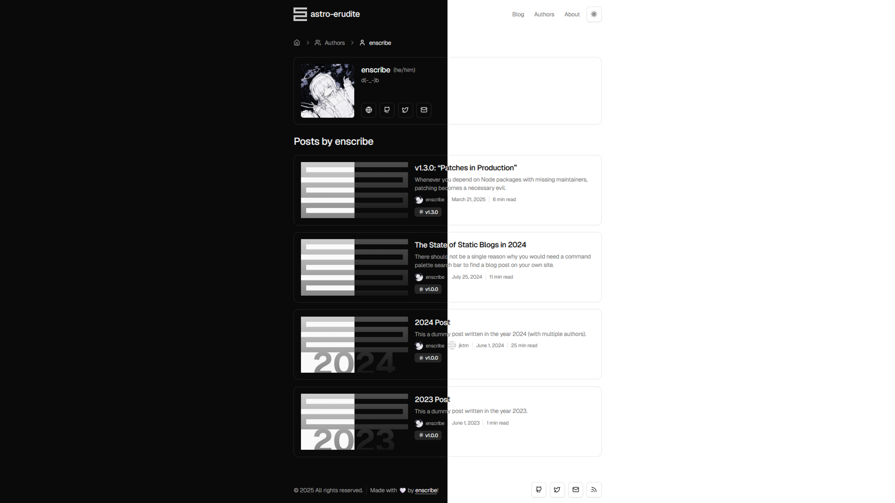
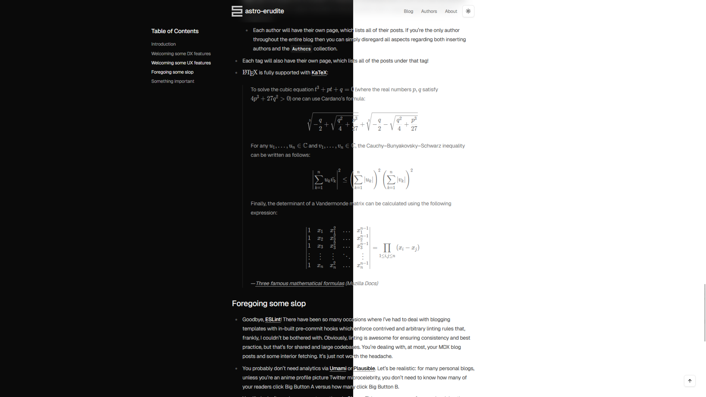

# QingYingX's Blog

一个基于 [Astro](https://astro.build/) 构建的中文静态博客项目，适合整理文章、笔记、教程和项目记录。项目基于 `astro-erudite` 演化而来，已经完成了中文化和站点信息定制，同时保留了较完整的博客能力。

| 预览 1                                 | 预览 2                                 |
| -------------------------------------- | -------------------------------------- |
|  |  |
|  |  |

## 功能特性

- 使用 Astro 静态生成，页面轻量、加载快、部署简单。
- 支持 MDX 写作，可在文章中直接使用 Astro 组件。
- 内置目录、标签页、作者页、分页、RSS 和 Sitemap。
- 支持子文章结构，适合拆分长文或系列内容。
- 集成 Expressive Code、Shiki 和 KaTeX，适合技术写作。
- 自带深浅色主题切换和 Astro View Transitions 页面过渡。
- 支持桌面端鼠标跟随小圆点效果，可在配置中一键开关。
- 内置 Twikoo 评论集成，支持懒加载、按文章关闭。
- 自带照片墙页面，方便展示静态图片集合。
- 基于 Tailwind CSS 4 和一组轻量 UI 组件，方便继续定制。

## 技术栈

| 分类     | 技术                         |
| -------- | ---------------------------- |
| 框架     | Astro 6                      |
| 样式     | Tailwind CSS 4               |
| 组件     | Astro 组件 + 少量 React 组件 |
| 内容     | Markdown / MDX               |
| 代码高亮 | Expressive Code、Shiki       |
| 数学公式 | KaTeX                        |
| 图标     | astro-icon、Lucide           |
| 类型检查 | TypeScript、`astro check`    |

## 快速开始

### 环境要求

- Node.js 22 或更高版本，Docker 镜像使用的是 `node:22-alpine`。
- npm，项目当前使用 `package-lock.json` 锁定依赖版本。
- Docker 与 Docker Compose 可选，仅在容器化运行时需要。

### 1. 安装依赖

```bash
npm install
```

### 2. 启动开发服务器

```bash
npm run dev
```

默认地址为 `http://localhost:39393`。开发端口由 `astro.config.ts` 中的 `server.port` 统一配置。

### 3. 构建生产版本

```bash
npm run build
```

### 4. 本地预览构建结果

```bash
npm run preview
```

## Docker 运行

项目已经内置 `Dockerfile` 和 `docker-compose.yml`，容器会监听 `39393` 端口。

### 使用 Docker Compose

```bash
docker compose up -d --build
```

启动后访问：

```text
http://localhost:39393
```

查看日志：

```bash
docker compose logs -f myblog
```

停止并移除容器：

```bash
docker compose down
```

### 使用 Docker 命令

```bash
docker build -t myblog .
docker run -d --name MyBlog -p 39393:39393 --restart unless-stopped myblog
```

当前镜像启动命令为 `npm run serve`，会先执行 `npm run build`，再通过 `npm run start` 启动 Astro 预览服务。如果修改了源码、内容或配置，请重新构建镜像后再启动容器。

## 常用命令

| 命令               | 说明                                                   |
| ------------------ | ------------------------------------------------------ |
| `npm run dev`      | 启动本地开发服务器，默认访问 `http://localhost:39393`  |
| `npm run build`    | 先做类型检查，再构建静态站点                           |
| `npm run preview`  | 本地预览构建后的站点                                   |
| `npm run start`    | 以 `0.0.0.0` 监听方式启动 Astro 预览服务，适合容器环境 |
| `npm run serve`    | 先构建再启动预览服务，Docker 默认执行这个命令          |
| `npm run astro`    | 执行 Astro CLI                                         |
| `npm run prettier` | 格式化 `ts`、`tsx`、`css`、`astro` 文件                |

## 目录结构

```text
.
├─ public/
│  ├─ fonts/                # 自托管字体
│  ├─ photos/               # 照片墙图片
│  ├─ projects/             # 项目卡片封面
│  ├─ static/               # 预览图、分享图等
│  └─ favicon.* / site.webmanifest  # 站点图标与 PWA manifest
├─ src/
│  ├─ components/           # 页面组件与 UI 组件（ui/ 下为轻量组件）
│  ├─ content/
│  │  ├─ authors/           # 作者资料
│  │  ├─ blog/              # 博客文章与子文章
│  │  └─ projects/          # 项目卡片内容
│  ├─ layouts/              # 页面布局
│  ├─ lib/                  # 数据处理与工具函数
│  ├─ pages/                # 路由页面（含 /photos、/tags、/authors、/blog 等）
│  ├─ styles/               # 全局样式与排版样式
│  ├─ config.ts             # 站点信息、导航、主题切换、评论等统一配置
│  ├─ content.config.ts     # 内容集合 schema
│  ├─ types.ts              # 公共类型定义
│  └─ env.d.ts              # Astro 环境类型
├─ astro.config.ts          # Astro 配置（端口、allowedHosts、Markdown 管线）
├─ Dockerfile               # Docker 镜像构建配置
├─ docker-compose.yml       # Docker Compose 运行配置
├─ components.json          # UI 组件配置
├─ tsconfig.json            # TypeScript 配置
├─ CLAUDE.md                # 给 Claude Code 的项目说明
└─ package.json             # 脚本与依赖
```

## 站点配置

项目里大多数"站点层面的调节项"都集中在 `src/config.ts`，日常修改时优先看这个文件。

当前主要配置项：

| 配置项                       | 说明                                                         |
| ---------------------------- | ------------------------------------------------------------ |
| `SITE`                       | 站点标题、描述、域名、默认作者、语言、首页精选数量、分页大小 |
| `NAV_LINKS`                  | 顶部导航链接                                                 |
| `SOCIAL_LINKS`               | 页脚和社交链接                                               |
| `THEME_TOGGLE.followPointer` | 主题切换圆形动效是否跟随鼠标位置                             |
| `CURSOR.enabled`             | 是否启用桌面端鼠标跟随小圆点                                 |
| `CURSOR.lag`                 | 鼠标圆点的跟随阻尼，值越大越跟手                             |
| `COMMENTS`                   | 评论系统（Twikoo）开关、服务地址、脚本/样式地址、懒加载      |
| `ICON_MAP`                   | 社交字段名称和图标的映射关系                                 |

例如，关闭鼠标跟随圆点可以这样改：

```ts
export const CURSOR = {
  enabled: false,
  lag: 0.22,
} as const
```

### 评论（Twikoo）

评论使用自部署的 [Twikoo](https://twikoo.js.org/)，在 `src/config.ts` 的 `COMMENTS` 中配置：

- `enabled`：全站评论总开关，关掉后不会加载评论脚本和样式。
- `defaultEnabled`：文章默认是否开启评论，可在单篇 frontmatter 用 `comments: false` 覆盖。
- `serverUrl`：Twikoo 后端地址，建议使用独立 HTTPS 域名（例如 `https://twikoo.example.com`），避免混合内容和跨域问题。
- `scriptUrl` / `styleUrl`：Twikoo 前端脚本与样式，可替换为自己的 CDN。样式在全局 `<head>` 中加载，保证 Astro View Transitions 切页后不丢失。
- `lazyLoad`：是否等评论区进入视口后再初始化。

Twikoo 后台的"安全域名"需要把博客域名加进去，否则会被拒绝跨域。

### 其他常改的位置

- `src/content.config.ts`：内容集合 schema，用来约束文章、作者、项目的 frontmatter 结构。
- `astro.config.ts`：Astro 插件、开发端口、站点域名、`allowedHosts`、Markdown 处理管线。
- `src/styles/global.css`：主题色、字体变量和基础样式。
- `src/styles/typography.css`：文章排版样式。
- `src/pages/index.astro`：首页文案与首页结构。
- `src/pages/about.astro`：关于页内容与项目展示区。
- `src/pages/photos.astro`：照片墙页面。

## 内容管理

### 写文章

在 `src/content/blog/` 下新增 `md` 或 `mdx` 文件即可。推荐使用单独目录存放文章正文与配图，例如：

```text
src/content/blog/my-first-post/
├─ index.mdx
└─ banner.png
```

文章 frontmatter 示例：

```yml
---
title: '我的第一篇文章'
description: '这里是一段文章摘要。'
date: 2026-04-13
tags: ['astro', 'blog']
image: './banner.png'
authors: ['qingying']
draft: false
---
```

当前博客内容 schema 支持以下字段：

| 字段          | 类型       | 是否必填 | 说明               |
| ------------- | ---------- | -------- | ------------------ |
| `title`       | `string`   | 是       | 文章标题           |
| `description` | `string`   | 是       | 文章摘要           |
| `date`        | `date`     | 是       | 发布日期           |
| `order`       | `number`   | 否       | 同一天的子文章排序 |
| `image`       | `image`    | 否       | 文章封面           |
| `tags`        | `string[]` | 否       | 标签列表           |
| `authors`     | `string[]` | 否       | 作者 id 列表       |
| `comments`    | `boolean`  | 否       | 覆盖该篇是否开启评论 |
| `draft`       | `boolean`  | 否       | 是否草稿           |

### 子文章

这个项目支持通过文件结构组织系列文章。只要某篇文章的 `id` 中包含 `/`，它就会被识别为子文章。

例如：

```text
src/content/blog/series-name/
├─ index.mdx
├─ part-1.mdx
└─ part-2.mdx
```

其中：

- `index.mdx` 是主文章。
- `part-1.mdx` 和 `part-2.mdx` 会作为子文章参与目录和导航。
- 不需要额外写 `parentId` 或系列字段，关系由文件路径自动推导。

### 作者

作者资料放在 `src/content/authors/` 下，一个文件对应一个作者。

```yml
---
name: '清影'
avatar: 'https://example.com/avatar.png'
bio: '这里是一段作者简介。'
website: 'https://example.com'
github: 'https://github.com/your-name'
mail: 'hello@example.com'
---
```

如果文章 frontmatter 中的 `authors` 写了对应文件名，文章页就会自动展示作者信息并链接到作者页。

### 项目

项目卡片数据放在 `src/content/projects/` 下，适合在“关于”页面展示作品、案例或长期维护中的项目。

```yml
---
name: '个人项目 A'
description: '一句话介绍你的项目。'
tags: ['Astro', '博客', '前端']
image: '../../../public/static/1200x630.png'
link: 'https://example.com'
startDate: '2026-01-01'
endDate: '2026-03-01'
---
```

`endDate` 除了填写普通日期外，也支持特殊值：

- `endDate: 'present'`

这个写法会在构建时自动显示为当天日期。

项目内容也支持按顶层文件夹分组展示。例如：

```text
src/content/projects/
├─ bots/
│  ├─ xiaomigao.md
│  └─ helper.md
├─ tools/
│  └─ cli.md
└─ project-a.md
```

在“关于”页面中：

- `bots/` 和 `tools/` 会显示为可展开的文件夹分组。
- `project-a.md` 这种直接放在根目录的项目会显示在“未分组项目”里。

如果你希望某个目录里的某个项目固定显示在最上面，可以在 frontmatter 里增加：

- `primary: true`

同一目录下被标记为主项目的条目会优先展示，然后再按开始时间倒序排序。

## 部署提醒

如果你要把这个项目改成自己的正式站点，至少同步检查下面两处：

- `src/config.ts` 中的 `SITE.href`
- `astro.config.ts` 中的 `site`

修改站点域名时，这两处最好保持一致，否则 RSS、Sitemap、canonical URL 和社交分享元信息可能会指向错误地址。

当前项目统一使用 `39393` 端口。如果你需要调整端口，请同时检查：

- `astro.config.ts` 中的 `server.port`
- `Dockerfile` 中的 `EXPOSE`
- `docker-compose.yml` 中的 `ports`

如果通过反向代理访问开发/预览服务（例如使用自己的域名访问 `npm run dev`），需要把域名加入 `astro.config.ts` 的 `server.allowedHosts`，否则会被 Vite 以 "Blocked request" 拒绝。

如果你准备部署到带子路径的站点，例如 `https://username.github.io/repo-name/` 这种 GitHub Pages 项目页，还需要额外检查 Astro 的 `base` 配置以及站内绝对路径资源是否匹配。

## 适合继续改造的方向

- 替换 `src/content/` 下的示例文章、作者和项目内容。
- 调整首页和关于页文案，让它更贴近你的用途。
- 更换 favicon、logo、封面图和字体。
- 增加新的社交字段、栏目页或自定义内容组件。

## License

本项目使用 [MIT License](LICENSE)。
