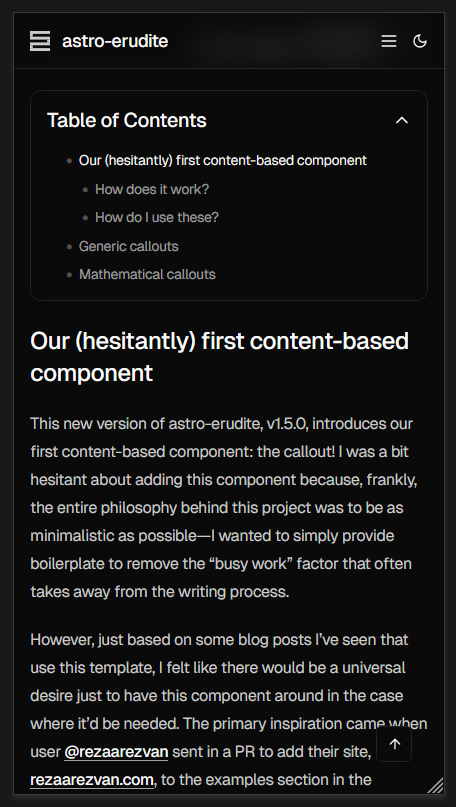
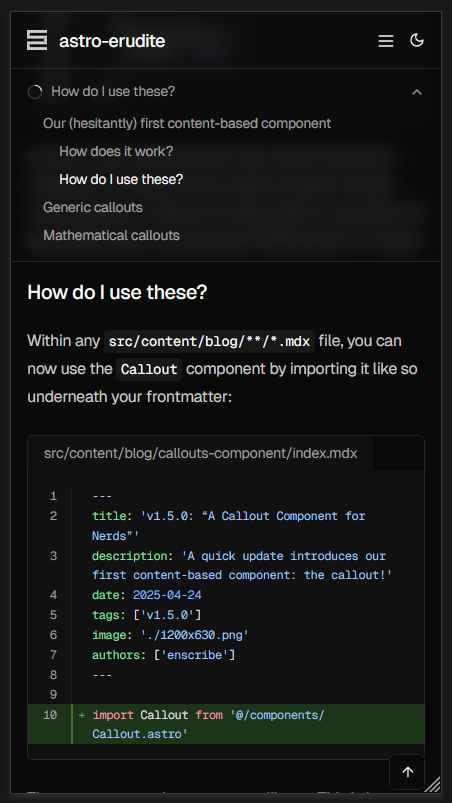
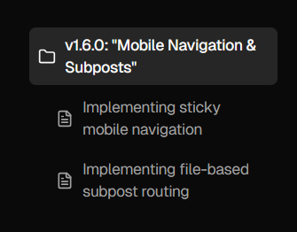

## 阅读体验的两项更新

这次版本更新主要围绕“长文更好读”展开。第一部分是移动端目录的重做，第二部分是子文章结构。前者解决的是手机阅读时不知道读到哪里的困扰，后者解决的是一篇大文章不容易拆分、也不容易导航的问题。

### 移动端目录

旧版移动端目录只是正文里的一个可折叠区域。它能用，但不够顺手，尤其是当文章很长时，读者滑到中段之后，很难再快速知道当前章节，也不方便立刻跳转。

<div class="max-w-xs mx-auto">

</div>

新版把目录提到页面顶部，放在主导航下面，滚动时会一直停留在可见区域。收起状态会展示当前章节，展开后则能像桌面端一样快速浏览整篇文章的结构。

<div class="flex gap-4 flex-wrap justify-center [&_img,p]:m-0">
  <div class="max-w-xs">
    
  </div>
  <div class="max-w-xs">
    
  </div>
</div>

### 子文章结构

第二个变化是“子文章”。它更适合那些主题相关、但单篇又过长的内容。你可以把一篇总览文章放在 `index.mdx`，再把更细的内容拆成同目录下的几个子文件。

<div class="flex gap-4 flex-wrap justify-center [&_img,p,.expressive-code]:m-0">
  <div class="max-w-3xs border">
    
  </div>
  <div class="max-w-3xs">

```bash showLineNumbers={false}
src/
  content/
    blog/
      mobile-nav-and-subposts/
        index.mdx
        mobile-navigation.mdx
        subposts.mdx
```

  </div>
</div>

这样的文件结构很直观：目录本身就是一组相关文章。列表页只会把主文章作为入口展示，读者点进来以后，再通过右侧或顶部的子文章导航继续往下看。

## 什么时候适合用子文章

如果你的内容符合下面这些特征，就很适合用子文章来组织：

- 主题统一，但单篇正文过长。
- 读者可能只关心其中某个部分。
- 你希望保留一篇“总览页”，又不想让列表里出现一连串碎片化文章。

对教程、旅行记录、项目复盘、系列笔记来说，这种结构都很自然。

## 阅读路径也一起优化了

子文章加入后，文章底部的上一篇/下一篇也会根据上下文自动变化。如果你正在看子文章，就可以继续前后切换，也能随时返回主文章。

<div class="border [&_img,p]:m-0">

</div>

## 继续阅读

这篇主文章下面还带着两篇子文章，分别讲移动端目录和子文章路由本身是怎么实现的。你可以继续沿着侧边栏往下读，也可以把这套结构直接拿去改成你自己的长文组织方式。
